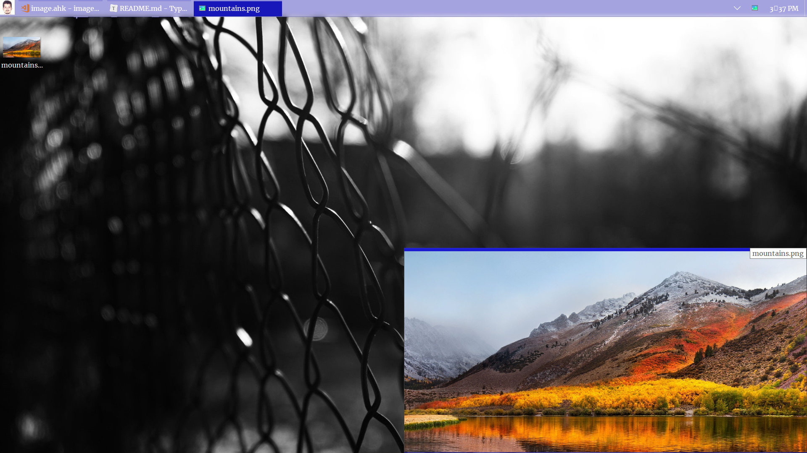
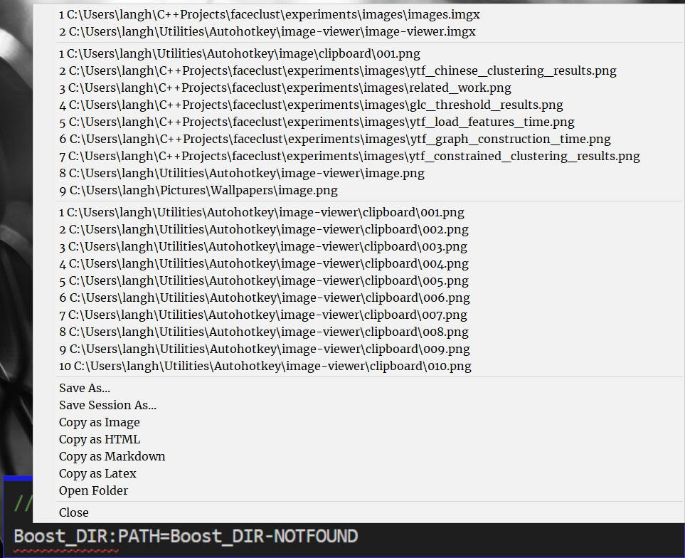

## Image Viewer <!-- omit in toc -->

 
- [Global keys](#global-keys)
- [Local (window focused) keys](#local-window-focused-keys)
- [Docked view](#docked-view)
- [Open menu (`Right click` or `o`)](#open-menu-right-click-or-o)

### Global keys

| Hotkey | Action                        |
| ------ | ----------------------------- |
| #s     | Select area for screenshot.   |
| ^#c    | Screenshot of current window. |
| #\|    | Activate window.              |
| !\|    | Restore all windows.          |

### Local (window focused) keys

| Hotkey | Action                            |
| ------ | --------------------------------- |
| Esc    | Exit application.                 |
| F5     | Reload image.                     |
| o      | Show tray menu.                   |
| f      | Open current folder.              |
| r      | Reset position and aspect ratio.  |
| !#-    | Decrease size and dock to bottom. |
| -      | Decrease size.                    |
| !#+    | Increase size and dock to bottom. |
| +      | Increase size.                    |
| ^c     | Copy to last destination.         |
| ^s     | Save to last destination.         |
| ^!s    | Save to secondary destination.    |
| ^r     | Reload window.                    |
| ^m     | Minimize all instances.           |
| m     | Minimize current instance.           |
| Left     | Select left instance excluding minimized ones.           |
| Right     | Select right instance excluding minimized ones.           |
| +Left     | Select left instance.           |
| +Right     | Select right instance.           |
| !Left     | Move left.           |
| !Right     | Move right.           |
| !Up     | Move up.           |
| !Down     | Move down.           |
| q     | Remove current file from Y stack.           |
| !#q     | Close all instances.           |
| !#^q     | Close all other instances except the current one.           |
| \|     | Activate previous document.           |
| r, w or h     |  Reset position and load original size.          |
| a     |  Reset aspect ratio using width.          |
| z     |  Reset aspect ratio using height.          |
| x     |  Dock X position.          |
| y     |  Dock Y position.          |
| ^y     |  Dock Y position using stack distance.          |
| +y     |  Remove all windows from Y stack.          |
| t     |  Toggle transparency.          |

### Docked view

### Open menu (`Right click` or `o`)
