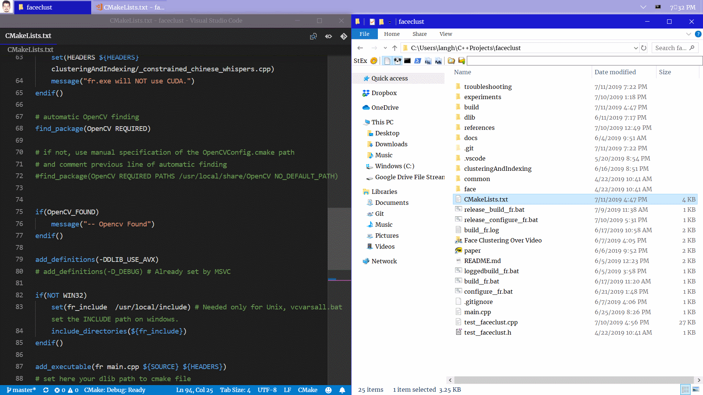

## Image Viewer <!-- omit in toc -->

 [](https://raw.githubusercontent.com/langheran/image-viewer/master/LICENSE.md)
- [Keyboard-only (no mouse) usage spoiler](#keyboard-only-no-mouse-usage-spoiler)
- [How to build](#how-to-build)
- [Command line usage](#command-line-usage)
- [Tray menu usage](#tray-menu-usage)
- [Global keys](#global-keys)
- [Local (window focused) keys](#local-window-focused-keys)
- [Explorer keys](#explorer-keys)
- [Docked view](#docked-view)
- [Open menu (`Right click` or `o`)](#open-menu-right-click-or-o)

### Keyboard-only (no mouse) usage spoiler



### How to build

1. Run `compile_ocr.bat`. This is only required to compile the managed code shared library loaded dynamically by `Copy as Text`. 
    1. You need _dotnet-cli_ and _tessdata v3.0.2_ language model files from _Tesseract-OCR_.
2. Run `compile_image.bat`.

### Command line usage

Open image.

```batch
image.exe "C:\Users\langh\Pictures\Wallpapers\blue.jpg"
```

Open all images in _Screenshots_ folder and save as session.

```batch
image.exe "C:\Users\langh\Pictures\Screenshots"
```

Open last saved session.

```batch
image.exe s
```

Capture image region.

```batch
image.exe r
```

Capture window image.

```batch
image.exe w
```

Open last image or clipboard.

```batch
image.exe
```

**Hint:** For each of these options you can create a shortcut on your desktop and then assign it a shortcut key. 

### Tray menu usage

| Menu | Action                        |
| ------------------ | -------------------- |
| Save As... | Save image file. |
| Save Session As... | Save session file. |
| Copy as File | Copy image as file to paste in explorer. |
| Copy as Image | Copy image to clipboard. |
| Copy as HTML | Copy html decoded image. |
| Copy as Markdown | Copy markdown image syntax with the image path. |
| Copy as Latex | Copy markdown includegraphics command with the image path. |
| Copy as Text | Copy text from image using OCR. |
| Open Folder | Open image folder. |

### Global keys

| Hotkey | Action                        |
| ------ | ----------------------------- |
| +#s     | Select area for screenshot.   |
| ^#c    | Screenshot of current window. |
| #\|    | Activate window.              |
| !\|    | Restore all windows.          |


### Local (window focused) keys

| Hotkey | Action                            |
| ------ | --------------------------------- |
| Esc    | Exit application.                 |
| F5     | Reload image.                     |
| o      | Show tray menu.                   |
| ^o      | Open current folder.              |
| f      | Toggle fullscreen.              |
| r      | Reset position and aspect ratio.  |
| !#-    | Decrease size and dock to bottom. |
| -      | Decrease size.                    |
| !#+    | Increase size and dock to bottom. |
| +      | Increase size.                    |
| ^c     | Copy to last destination.         |
| ^s     | Save to last destination.         |
| ^!s    | Save to secondary destination.    |
| ^r     | Reload window.                    |
| ^m     | Minimize all instances.           |
| m     | Minimize current instance.           |
| Left     | Select left instance excluding minimized ones.           |
| Right     | Select right instance excluding minimized ones.           |
| +Left     | Select left instance.           |
| +Right     | Select right instance.           |
| !Left     | Move left.           |
| !Right     | Move right.           |
| !Up     | Move up.           |
| !Down     | Move down.           |
| q     | Remove current file from Y stack.           |
| !#q     | Close all instances.           |
| !#^q     | Close all other instances except the current one.           |
| \|     | Activate previous document.           |
| r, w or h     |  Reset position and load original size.          |
| a     |  Reset aspect ratio using width.          |
| z     |  Reset aspect ratio using height.          |
| x     |  Dock X position.          |
| y     |  Dock Y position.          |
| ^y     |  Dock Y position using stack distance.          |
| +y     |  Remove all windows from Y stack.          |
| t     |  Toggle transparency.          |
| ^x     |  Cut image file from location.          |
| F2     |  Rename image.          |

### Explorer keys
| Hotkey | Action                            |
| ------ | --------------------------------- |
| ^F2     |  Rename image to current datetime and preserve settings.          |
| ^F7     |  Open folder as session.          |

### Docked view


### Open menu (`Right click` or `o`)
